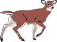
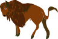
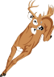

edUI
====

educational interface

##Version 1.1

Use last version of external libs jQuery 1.9.1 and jQuery UI 1.10.3

fix a bug : reinitiate the number of card found to zero.

##Version 1.0

1 memo game available.

The configuration is based on xml and use jQuery UI .


###xml directory

Each board are defined in an xml file.


####The board tag
The board tag defines the accordion containing all the decks available for one theme.

####The deck tag 
The deck tag contains all the couple of card for one memory.

|attribute|type|description
|---|---|---|
|hideunselected|boolean|the unselected card are hidden (advanced player) or not (young player)|
|name|string|Link name in the accordeon|
|description|string|Short description|


####The couple tag
the couple tag contains two card tag that are a couple.

Couple with img

```xml
      <couple>
        <card><![CDATA[]]></card>
        <card><![CDATA[]]></card>
      </couple>
``` 

Couple with text

```xml
      <couple>
        <card><![CDATA[<span style="vertical-align: middle; ">Ils</span>]]></card>
        <card><![CDATA[<span style="vertical-align: middle; ">sont</span>]]></card>
      </couple>
```


####Example of configuration
```xml

<?xml version="1.0" encoding="ISO-8859-1"?>
<board>
  <title>My first memory</title>
  <description>memory for babies</description>
  <decks>
    <deck hideunselected="false" name="Animaux 1" description="Trouve les deux images d'animaux identiques">
      <couple>
        <card><![CDATA[]]></card>
        <card><![CDATA[]]></card>
      </couple>
      <couple>
        <card><![CDATA[]]></card>
        <card><![CDATA[]]></card>
      </couple>
      <couple>
        <card><![CDATA[]]></card>
        <card><![CDATA[]]></card>
      </couple>
      <couple>
        <card><![CDATA[]]></card>
        <card><![CDATA[]]></card>
      </couple>
      <couple>
        <card><![CDATA[]]></card>
        <card><![CDATA[]]></card>
      </couple>
      <couple>
        <card><![CDATA[]]></card>
        <card><![CDATA[]]></card>
      </couple>
      <couple>
        <card><![CDATA[]]></card>
        <card><![CDATA[]]></card>
      </couple>
      <couple>
        <card><![CDATA[]]></card>
        <card><![CDATA[]]></card>
      </couple>
    </deck>
  </decks>
</board>
```

###img directory

All images in img came from http://openclipart.org/


